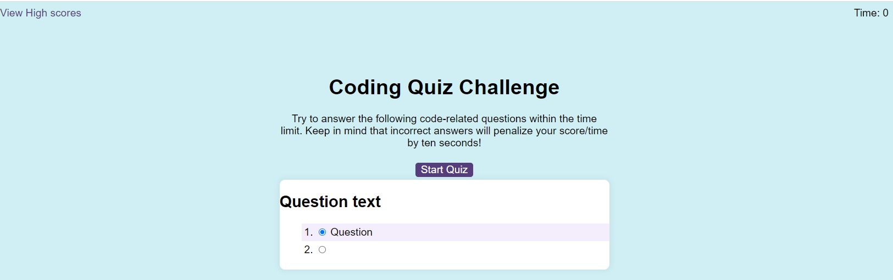

# JS-Timed-coding-Quiz
## API module Challenge Description
Create a code quiz that contains the following requirements:
* A start button that when clicked a timer starts and the first question appears.
* Questions contain buttons for each answer.
* When answer is clicked, the next question appears
* If the answer clicked was incorrect then subtract time from the clock
* The quiz should end when all questions are answered or the timer reaches 0.
* When the game ends, it should display their score and give the user the ability to save their initials and their score

## Activities covered
Start by splitting the task into smaller subtasks, in script.js file, first writing pseudocode for each subtask and then adding the corresponding code to it.
 * A start button that can be clicked
 * A timer that starts when the button when clicked
  * A set of questions and the first question appears when the timer starts counting
  * Questions contain buttons for each answer
  * When answer is clicked, the next question appears
  * If the answer clicked was incorrect then subtract time from the clock
  * The quiz should end when all questions are answered or the timer reaches 0.
 * When the game ends, it should display their score and give the user the ability to save their initials and their score
  - prevent default in order to retain the data input from user

In html file, I've added the required link tags to my head element and the script tags right before the closing. 
  ## Screenshots
- Live server:

- Github page:

  ## Links
GitHub repository: https://github.com/Marilena-C/JS-Timed-coding-Quiz

Deployed website: https://marilena-c.github.io/JS-Timed-coding-Quiz/